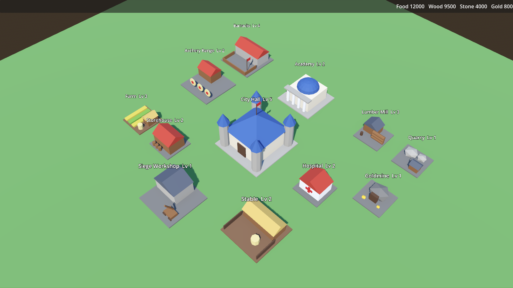

# Open Kingdoms

A free and open-source kingdom strategy game inspired by Rise of Kingdoms.
Build your city, gather across a shared world map, lead historical commanders
and fight with your alliance for the kingdom. **No microtransactions, no
gacha, no pay-to-win.**



> Early development (Phase 0 complete). See [docs/ROADMAP.md](docs/ROADMAP.md).
> Not affiliated with Lilith Games or Rise of Kingdoms.

## Stack

- **Server:** Rust (tokio, axum), authoritative, one process per kingdom
- **Client:** Godot 4.8, GDScript, 3D isometric; PC and web first
- **Art:** low-poly models generated procedurally with Blender's Python API
- **Data:** all balance in editable YAML in [`data/`](data/)

## Run it

```bash
# 1. Server
cd server && cargo run -p kingdom-server     # listens on ws://127.0.0.1:7777/ws

# 2. Client (Godot 4.8)
godot --path client                          # enter any name and press Play
```

## Develop

```bash
scripts/verify.sh   # format, lint, Rust tests, Godot unit tests, client-server e2e
```

This project is developed by AI agents following [CLAUDE.md](CLAUDE.md).
The design is in [docs/DESIGN.md](docs/DESIGN.md) and progress in
[docs/DEVLOG.md](docs/DEVLOG.md).

## License

- Code: [AGPL-3.0](LICENSE). If you run a modified server, share your changes.
- Art, models and data files (`client/assets/`, `data/`): [CC BY-SA 4.0](ASSETS_LICENSE.md).
